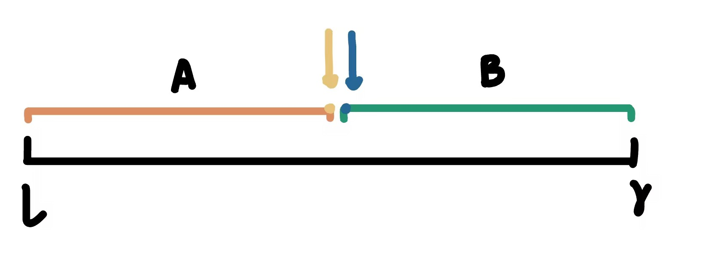
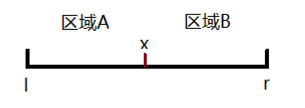

## 目录
- [整数离散化](#整数离散化)
- [位运算](#位运算)
- [高精度](#高精度)
  - [高精度加法](#高精度加法)
  - [高精度减法](#高精度减法)
  - [高精度乘法](#高精度乘法)
  - [高精度除法](#高精度除法)
- [区间更新:差分算法](#区间更新差分算法)
- [二分查找](#二分查找)
- [前缀和](#前缀和)
- [双指针](#双指针)
  - [无重复字符串的最长子串](#无重复字符串的最长子串) 
- [排序专场](#排序专场)
  - [快速排序](#快速排序)
  - [归并排序](#归并排序)
- [链表专场](#链表专场)
  - [反转链表](#反转链表)
  - [回文链表](#回文链表)
  - [判断是否是环形链表](#判断是否是环形链表)
  - [寻找两个链表的交点](#寻找两个链表的交点)
  - [找出出现次数大于 n/2 的数字](#找出出现次数大于-n2-的数字)
  - [两个链表加和](#两个链表加和)
- [二叉树专场](#二叉树专场)
  - [二叉树遍历方法](#二叉树遍历方法)
  - [判断二叉树是否对称](#判断二叉树是否对称)
  - [翻转二叉树的左右子树](#翻转二叉树的左右子树)
  - [二叉树的直径](#二叉树的直径)
  - [二叉树的合并](#二叉树的合并)
- [最长回文子串](#最长回文子串)
- [盛水最多的容器](#盛水最多的容器)
---

<!-- <div style="column-count: 2;">
    <ul>
        <li><a href="#区间更新差分算法">区间更新:差分算法</a></li>
        <li><a href="#二分算法">二分算法</a></li>
        <li><a href="#前缀和">前缀和</a></li>
        <li><a href="#双指针">双指针</a></li>
        <li><a href="#归并排序">归并排序</a></li>
        <li><a href="#链表专场">链表专场</a></li>
            <ul>
                <li><a href="#反转链表">反转链表</a></li>
                <li><a href="#回文链表">回文链表</a></li>
                <li><a href="#判断是否是环形链表">判断是否是环形链表</a></li>
                <li><a href="#寻找两个链表的交点">寻找两个链表的交点</a></li>
                <li><a href="#找出出现次数大于-n2-的数字">找出出现次数大于 n/2 的数字</a></li>
                <li><a href="#两个链表加和">两个链表加和</a></li>
            </ul>
        <li><a href="#二叉树专场">二叉树专场</a></li>
            <ul>
                <li><a href="#二叉树遍历方法">二叉树遍历方法</a></li>
                <li><a href="#判断二叉树是否对称">判断二叉树是否对称</a></li>
                <li><a href="#翻转二叉树的左右子树">翻转二叉树的左右子树</a></li>
                <li><a href="#二叉树的直径">二叉树的直径</a></li>
                <li><a href="#二叉树的合并">二叉树的合并</a></li>
            </ul>
        <li><a href="#无重复字符串的最长子串">无重复字符串的最长子串</a></li>
        <li><a href="#最长回文子串">最长回文子串</a></li>
        <li><a href="#盛水最多的容器">盛水最多的容器</a></li>
    </ul>
</div> -->

## 整数离散化 <a name="整数离散化"></a>
> 给出一列数字，在有些情况下，这些数字的值的绝对大小不重要，而相对大小很重要。例如，对一个班级学生的成绩进行排名，此时不关心成绩的绝对值，只需要输出排名，如分数为{95,50,72,21},排名为{1,3,2,4}。
>
> <u>离散化</u> 就是用数字的相对值替代它们的绝对值。离散化是一种数据处理的技巧，它把分布广而稀疏的数据转换为密集分布，从而能够让算法更快速、更省空间地处理。
>
> 例如，{4000,201,11,45,830}，数字的分布很稀疏，按大小排序为{5,3,1,2,4}，若算法处理的是数字的相对位置问题，那么对后者的处理更容易。
> 
> 离散化中存在两个问题：
> 1. 数组中有重复元素，要进行去重，去除重复的下标：sort后erase
> 2. 如何算出x离散化后的值是多少：二分查找（第一个>=x的位置）
> 
> **例题：区间和**
>
> 有一个无限长的数轴，每个坐标上的数字初始都是0，进行n次操作，每次将某一位置上的x加上c，进行m次询问，每次询问含有两个整数l和r，求出区间[l,r] 间所有数字的和。
> 
> 解法：离散化（区间内数字较稀疏）+前缀和（求一段区间内数字的和）
> 
> **Key part:**
> ```cpp
> #include<iostream>
> #include<vector>
> #include<algorithm>
> 
> using namespace std;
> 
> const int N=30010;
> int a[N],s[N]; //a用于存储离散化后的数组，s用于存储a数组的前缀和
> vector<int> alls; //存储所有用到的下标：查询的下标（l，r），插入数据的下标 x
> typedef pair<int,int> PII; //自定义一个向量对来存储查询和添加操作
> vector<PII> add,query;
> 
> int find(int x){
>     int l=0,r=alls.size()-1;
>     
>     while(l<r){
>         int mid=l+r>>1; 
>         if(alls[mid]>=x) r=mid;
>         else l=mid+1;
>     }
>     
>     return r+1;
> } //二分查找
> 
> int main(){
>     int n,m;
>     cin>>n>>m;
>      //输入需要加的位置和数值
>     for(int i=0;i<n;i++){
>         int x,c;
>         scanf("%d%d",&x,&c);
>         alls.push_back(x);
>         add.push_back({x,c});
>         
>     }
>     
>       //输入查询的区间
>     for(int i=0;i<m;i++){
>         int l,r;
>         scanf("%d%d",&l,&r);
>         alls.push_back(l);
>         alls.push_back(r);
>         query.push_back({l,r});
>     }
>    // 排序和去重，方便进行离散化
>     sort(alls.begin(),alls.end());
>     alls.erase(unique(alls.begin(),alls.end()),alls.end());
>     
>      //离散化数组a，加上需要插入的值c
>     for(int i = 0; i < add.size(); i++){
>    int x = find(add[i].first);
>    a[x] = a[x] + add[i].second;
> }
>
>     //求前缀和
>     for(int i=1;i<=alls.size();i++){
>         s[i]=s[i-1]+a[i];
>     }
>     //进行查询，l和r也要进行离散化
>    
>      for(int i = 0; i < query.size(); i++){
>          int l = find(query[i].first), r = find(query[i].second);
>          printf("%d", s[r] - s[l - 1]);
>      }
>    //或者
>	
>	  /*for(auto item:add){
>	     int x=find(item.first);
>	      a[x]=a[x]+item.second;
> 	}
>
>   for(auto item:query){
>      int l=find(item.first),r=find(item.second);
>     printf("%d",s[r]-s[l-1]);
> }	
> */
>
>     return 0;
> }
> ```
>
> ps: [归并排序例题](#归并排序)：火柴排队中介绍了另一种离散化方法


 ## 位运算 <a name="位运算"></a>
> ### n的二进制中，第k位是多少
> 1.先把第k位的移动到最后一位：`>>k`
>
> 2.再看个位是多少：`x&1`
>
> 3.综合即是：`x>>k&1`

> ### lowbit
> `lowbit(x)` 的作用是返回 `x` 的最后一位1（最右边的）
> 
> eg. x=1010，lowbit(x)=10
> 
> 所以，我们可以利用 `x&-x` 来统计 二进制`x` 中1的个数：每次减去 `x` 中的最后一位1，减去一次 `res++`
> 
>    **Key part:**
> ```cpp
> int lowbit(int x){
>     return x&-x;
> }
> 
> int hammingWeight(int n) {
>     int res=0;
>     while(n){
>         n=n-lowbit(n);
>         res++;
>     }
>     return res;
> }
> ``` 


 ## 高精度 <a name="高精度"></a>
> 
>
> ### 高精度加法 <a name="高精度加法"></a>
>    1.用数组来存储大整数，0存储个位，方便最后一位要进位的时候进位。用t来存储进位。
>
>    2.采用C++中的`vector`来代表存储，因为`vector`有`push_back`以及`size`函数。
>    
>    **Key part:**
>    ```cpp
>    #include<vector> //头文件要引入
>    vector<int> A,B;// A，B向量的声明
>    auto c;// 用于存储计算结果，auto可以让编译器根据初始化表达式的类型推断变量类型，即可以省略变量类型。
>    
>    //将输入的字符串a,b转换为vector
>    for(int i=A.size()-1;i>=0;i--) A.push_back(a[i]-'0');
>    for(int i=B.size()-1;i>=0;i--) B.push_back(b[i]-'0');
>    
>    //函数
>    vector<int> add (vector<int> &A,vector<int> &B){
>      vector<int> c;
>      int t=0;
>      for(int i=0;i<A.size()||i<B.size();i++){
>        if(i<A.size()) t=t+A[i];
>        if(i<B.size()) t=t+B[i];
>        c.push_back(t%10);
>        t=t/10;
>      }
>      if(t) c.push_back(1);
>      return c;
>    }
>    ```

> ### 高精度减法 <a name="高精度减法"></a>
> 1. 首先要进行一个判断，判断A,B两数的大小，如果A>B,直接进行`sub(A,B)`，如果A<B,则要输出`-（B-A）`，即`-sub(B,A)`,`bool cmp`函数用于比较大小，先比较AB的位数，位数相同再从高位开始比较第一个不相同的数字谁大谁小。
> 2. 进行减法时，如果`A_i-B_i-t>=0`,则直接减，如果<0,则要进行借位，答案应等于`A_i-B_i+10`。要注意去除前导0。
>
> **Key part:**
> ```cpp
> #include<iostream>
> #include<vector>
> #include<algorithm>
> using namespace std;
> 
> bool cmp(vector<int> &A,vector<int> &B){
>   if(A.size()!=B.size()) return A.size()>B.size(); //两个向量长度不等的情况
>   for(int i=A.size()-1;i>=0;i--){ //如果当两个向量长度相等
>     if(A[i]!=B[i]) return A[i]>B[i];
>   }
>   return true;
> }
> vector<int> sub(vector<int> &A,vector<int> &B){
>   vector<int> c;
>   
>   for(int i=0,t=0;i<A.size();i++){
>       t=A[i]-t;
>       if(i<B.size()) t=t-B[i];
>       c.push_back((t+10)%10); //将两种情况整合在一起
>       if(t<0) t=1; //借位判断
>       else t=0;
>   }
>   while(c.size()>1&&c.back()==0) c.pop_back(); //前导0的去除，直到c只有一位或者0全部被去除停止。
>   return c;
> }
> 
> int main(){
>     vector <int> A,B,c;
>     string a,b;
>     cin>>a>>b; //string的输入要用cin
>     for(int i=a.size()-1;i>=0;i--) A.push_back(a[i]-'0');
>     for(int i=b.size()-1;i>=0;i--) B.push_back(b[i]-'0');
>     // 两种不同情况下A,B的输入输出
>     if(cmp(A,B)){
>         c=sub(A,B);
>         for(int i=c.size()-1;i>=0;i--){
>             printf("%d",c[i]);
>         }
>     }else{
>         c=sub(B,A);
>         printf("-");
>         for(int i=c.size()-1;i>=0;i--){
>             printf("%d",c[i]);
>         }
>     }
>     return 0;
> }
> ```

> ### 高精度乘法 <a name="高精度乘法"></a>
> 此处的高精度是一个大整数乘以一个int型整数,与加法模板类似。
>
>  **Key part:**
> ```cpp
> int t=0;
> for(int i=0;i<A.size()||t;i++){
>    if(i<A.size()) t=A[i] *b;
>    c.push_back(t%10);
>    t=t/10;
> }
>```

> ### 高精度除法 <a name="高精度除法"></a>
> 大整数除以int型整数
>
> **Key part:**
> ```cpp
> #include<iostream>
> #include<algorithm>
> #include<vector>
> 
> using namespace std;
> 
> vector<int> div(vector<int> &A,int b,int &r){ //r是引用，从地址上改变值，方便最后的输出。
>     vector<int> c;
>     r=0;
>     for(int i=A.size()-1;i>=0;i--){
>         r=r*10+A[i];
>         c.push_back(r/b);
>         r=r%b;
>     }
>     reverse(c.begin(),c.end()); //reverse保证顺序正确
>     while(c.size()>1&&c.back()==0) c.pop_back();
>     return c;
> } 
> 
> int main()
> {
>     vector<int> A,c;
>     string a;
>     int r,b;
>     cin>>a>>b;
> 
>     
>     for(int i=a.size()-1;i>=0;i--){
>         A.push_back(a[i]-'0');
>     }
>     
>     c=div(A,b,r);
>     for(int i=c.size()-1;i>=0;i--){
>         printf("%d",c[i]);
>     
>     }
>         cout<<endl<<r<<endl; //要用cout输出
>     return 0;
> }
> ```


## 区间更新:差分算法 <a name="区间更新差分算法"></a>
> <u>适用场景</u>: 适用于一个区间都要加上/减去一个固定的数字。
>
> **原理:** 
> 
> $a_0=0$, $b_1=a_1=a_0$, $b_2=a_2-a_1$, $b_s=a_s-a_{s-1}$, $b_x=a_x-a_{x-1}$, $b_{t+1}=a_{t+1}-a_t$, $b_n=a_n-a_{n-1}$
> 
>
> 所以$a_1=b_1$,$a_2=b_1+b_2$,$a_3=b_1+b_2+b_3$...$a_n=b_1+b_2+...+b_n$
> 由于要对区间 $a_s$ 到 $a_t$ 之间的 $a$，每个都要加 $d$，对于 $b$ 相当于只有 $b_s$ 加了 $d$，$b_{t+1}$ 多减去了 $d$，而其余 $b$ 的大小不变。将区间变化转化为只对新建的 $b$ 数组中的两 
> 个数字做变化。
>
> **Key part:**
> 构建一维差分数组（构建前记得开辟数组空间： `memset(b,0,sizeof(b));`）
> ```cpp
> #include <iostream>
> 
> using namespace std;
> 
> const int N = 100010;
> int n, m;
> int a[N], b[N];
> 
> void insert(int l, int r, int c) {
>     b[l] += c;
>     b[r + 1] -= c;
> }
> 
> int main() {
>     scanf("%d%d", &n, &m);
>     for (int i = 1; i <= n; i++) scanf("%d", &a[i]);
> 
>     for (int i = 1; i <= n; i++) insert(i, i, a[i]);
> 
>     while (m--) {
>         int l, r, c;
>         scanf("%d%d%d", &l, &r, &c);
>         insert(l, r, c);
>     }  
> 
>     for (int i = 1; i <= n; i++) b[i] += b[i - 1];
>     for (int i = 1; i <= n; i++) printf("%d ", b[i]);
> 
>     return 0;
> }
> ```
>
> **Key part:**
> 构建二维差分数组,与一维数组相同，关键在于insert函数。
> ```cpp
> #include<iostream>
> #include<cstdio>
> using namespace std;
> const int N = 1e3 + 10;
> int a[N][N], b[N][N];
>
> void insert(int x1, int y1, int x2, int y2, int c)
> {
>     b[x1][y1] += c;
>     b[x2 + 1][y1] -= c;
>     b[x1][y2 + 1] -= c;
>     b[x2 + 1][y2 + 1] += c;
> }
> int main()
> {
>     int n, m, q;
>     cin >> n >> m >> q;
>     for (int i = 1; i <= n; i++)
>         for (int j = 1; j <= m; j++)
>             cin >> a[i][j];
> 
>     for (int i = 1; i <= n; i++)
>     {
>         for (int j = 1; j <= m; j++)
>         {
>             insert(i, j, i, j, a[i][j]);      //构建差分数组
>         }
>     }
> 
>     while (q--)
>     {
>         int x1, y1, x2, y2, c;
>         cin >> x1 >> y1 >> x2 >> y2 >> c;
>         insert(x1, y1, x2, y2, c);
>     }
>     for (int i = 1; i <= n; i++)
>     {
>         for (int j = 1; j <= m; j++)
>         {
>             b[i][j] += b[i - 1][j] + b[i][j - 1] - b[i - 1][j - 1];  //二维前缀和
>         }
>     }
>     for (int i = 1; i <= n; i++)
>     {
>         for (int j = 1; j <= m; j++)
>         {
>             printf("%d ", b[i][j]);
>         }
>         printf("\n");
>     }
>     return 0;
> }
> ```
>
> **相关例题**: 
>
> 562壁画：用for循环遍历m~n,在此区间内找和max的区间,区间大小为m.


---
## 二分查找 <a name="二分查找"></a>
> 二分查找的本质是边界问题，需要寻找一个边界，使得一半满足要求，一半不满足。
> 
> 
> 1. 整数二分：有边界问题
>    - 二分查找会因为不同的边界点情况而不同，如果边界点属于A，mid=l+r+1/2（区间被划分为[l,mid],[mid+1,r]）
>    
>    **Key part:**
>    ```cpp
>    int l=0,r=n;
>    while(l<n){
>      int mid=l+r+1>>1;
>      if(check(mid)) 
>          l=mid;
>      else 
>          r=mid-1;
>    }
>    return r;
>    ```
>    - 如果边界点属于B，那么mid=l+r/2（区间被划分为[l,mid-1],[mid,r]）
>
>    **Key part:**
>    ```cpp
>    int l=0,r=n;
>    while(l<n){
>      int mid=l+r>>1;
>      if(check(mid))
>          r=mid;
>      else 
>          l=mid+1;
>    }
>    ```
>
> 2. 浮点数二分，没有边界问题。


---
## 前缀和 <a name="前缀和"></a>
> <u>*适用场景*</u>: 求任意区间内数字的总和
>
> 或求子矩阵的和:`s[i][j]=s[i-1][j]+s[i][j-1]-s[i-1][j-1]+a[i][j] `
> 最后面积为`s[x2][y2]-s[x1-1][y2]-s[x2][y1-1]+s[x1-1][y1-1]`。
>
> **原理:** 
> 构建前缀和数组
>
> 设 s_0=0, s_1=a_1, s_2=a_1+a_2, ..., s_{i-1}=a_1+a_2+...+a_{i-1}, s_i=a_1+a_2+...+a_i, s_n=a_1+a_2+...+a_n。
>
> 可以知道，s_1-s_{i-1}=a_i, s_i=a_i+s_{i-1}。所以，想得到 a_1+a_2+...+a_r，可以转化为求 s_k-s_{l-1}。
>
> ps:
> 1. 记住要从1开始构建前缀和数组。
> 2. C++的头部: `#include <iostream>`，`using namespace std;` 包含 `max` 函数。
> 3. `scanf("%s",str+1)` 相当于数组指针后移，从第一个数字开始。
>
> **Key part**
> ```cpp
> #include<iostream>
> #include<algorithm>
> 
> using namespace std;
> 
> int main(){
>     int m,n;
>     scanf("%d%d",&n,&m);
>     
>     int a[10010],s[10010];
>     for(int i=1;i<=n;i++){
>         scanf("%d",&a[i]);
>         
>     }
>     
>     for(int i=1;i<=n;i++){
>         s[i]=a[i]+s[i-1]; //构建前缀和数组
>     }
>     
>     while(m--){
>         int l,r;
>         scanf("%d%d",&l,&r);
>         printf("%d\n",s[r]-s[l-1]); // 输出第r到第l个数字的和
>     }
> }
> ```
>
> <u>*相关例题*</u>: 
>
> 562壁画：用for循环遍历m~n,在此区间内找和max的区间,区间大小为m.


---

## 双指针 <a name="双指针"></a>
> <u>*适用场景*</u> ：对于每一个i来说，在一个<u> 单调</u> 递减的数组里找到>=它的最后一个数字。（此处单调指的是一个下标关于另一个下标单调），适用于有序数组，属于优化算法。
>
> ps:
> h指数：大于等于 `h` 的数字至少有 `h` 个（在所有满足 `h` 的数字中取 `max`）。
>
> **Key part:**
> ```cpp
> for(int i=1,j=n;i<=n;i++){
>  while(w[j]<i&&j) j--;
>  if(w[i]>=i-1&&i-j<=l)
>      res=i;
> }
> ```
> 1. C++ `sort` 用法：`sort(起始位置，终止位置，排序方式)`；例如：`sort(w + 1, w + n + 1, greater<int>());`，`sort(a.begin(), a.> 
end())`。
> 2. `b = num.size()`
>
>
> <u>*相关例题*</u>: 
>
> 3745 牛的学术圈：用 `for` 循环遍历 `m` 到 `n`，在此区间内找和 `max` 的区间，区间大小为 `m`。

> ### 无重复字符串的最长子串 <a name="无重复字符串的最长子串"></a>
>
> 采用<u>滑动窗口</u>机制，设置两个指针 `left` 和 `right` 来控制窗口的边界(即双指针)，用 `res` 记录最终结果，用 `temp[128]` 记录字符出现的情况（因为 ASCII 字符表总共 128 个字符）。
>
> **Key part:**
> ```c
> while (right < strlen(s)) {
>     if (temp[s[right]] == 0) {
>         temp[s[right]] = 1; // 标记该字符已经出现
>         right++;
>         count++;
>         res = res > count ? res : count; // 更新最长子串长度
>     } else {
>         temp[s[left]] = 0; // 标记该字符，相当于没有出现过，重新开始计数
>         left++; // 移动窗口的左边界
>         count--; // 减少计数
>     }
> }
> ```
>
> 这个机制通过滑动窗口的左右边界调整，来保持窗口内字符串中的字符没有重复，并通过 `count` 和 `res` 记录最长的无重复子串的长度。
>
> <u>或经典双指针做法</u>
>
> **Key part:**
> ```c
> int max(int a,int b){
>    return a>b?a:b;
> }
> int lengthOfLongestSubstring(char* s) {
>    int a[100010];
>    int res=0;
>    memset(a,0,sizeof(a));
>    for(int i=0,j=0;i<strlen(s);i++){
>        a[s[i]]++;
>        while(a[s[i]]>1){
>            a[s[j]]--;
>            j++;
>        }
>        res=max(res,i-j+1);
>    }
>    return res;
> }
> ```
---


## 排序专场 <a name="排序专场"></a>

> ### 快速排序 <a name="快速排序"></a>
> 快速排序的核心思想是<u>分治</u>
>
> 
>
> 1. 先选择选择分界点，有四种方法：
>    - 选择左边界 `q[l]`
>    - 选择右边界 `q[r]`
>    - 选择中间点 `q[(l + r) / 2]`
>    - 随机选择一个点
>
> 2. 目标：通过重新划分区间，使得 A 区间中的数字都小于等于 x，而 B 区间中的数字都大于等于 x。
>
> 3. 递归处理：采用递归的方法处理 A、B 区间。
>
> 两种做法：
>
> 1. 暴力做法：开辟两个数组，数组 a 和数组 b，将 q 中的数字逐个和 x 比较，小于 x 的放入 a，其余放入 b。
>
> 2. **优化算法：** 用两个指针 i 和 j 分别指向 l 和 r，执行 ++i 和 --j 往中间移动。x 与 i，j 指向的每个数字进行比较，直到 i 遇到比 x 大的数字停止移动，j 遇到比 x 小的数字停止移动，然后 i，j 交换所指的数字。这一过程一直循环直到 i 和 j 相遇停止。
>
>**Key part:**
> ```cpp
> int quick_sort(q[],r,l){
>   if(l>=r) return;
>    int i = l - 1, j = r + 1, x = q[l + r >> 1];
>   while(i<j) {
>     do i++; while (q[i]<x);
>     do j++; while (q[j]>x);
>     if(i<j) swap(q[i],q[j]);
>   }
>   quick_sort(q,l,j),quick_sort(q,j+1,r);
> }
> ```

> ### 归并排序 <a name="归并排序"></a>
> **Key part：**
> ```cpp
> void merge_sort(int q[], int l, int r){
>     if(l >= r) return;
>     
>     int mid = l + r >> 1;
>     merge_sort(q, l, mid);
>     merge_sort(q, mid + 1, r); // 递归
> 
>     int k = 0, i = l, j = mid + 1;
> 
>     while(i <= mid && j <= r){
>         if(q[i] <= q[j]){
>             tmp[k++] = q[i++];
>         } else {
>             tmp[k++] = q[j++];
>         } // 较小的数字加入 tmp 数组
>     } 
> 
>     while(i <= mid) tmp[k++] = q[i++];
>     while(j <= r) tmp[k++] = q[j++]; // 处理一个数组已经复制完的情况
> 
>     for(i = l, j = 0; j <= k; i++, j++)
>         q[i] = tmp[j];
> }
> ```
>
> <u>*相关例题*</u>: 
>
> 505 火柴排队:
> 
> 1. 若结果跟数组内具体大小无关，只需相对大小，即可进行离散化，将数组内的数字离散化到1~n。
> 
>
> **离散化Key part：**
> ```cpp
> for(int i = 1; i <= n; i++) p[i] = i; // 先将下标记录
> sort(p + 1, p + n + 1, [&](int x, int y){
>       return a[x] < a[y];
>   }); // sort 完之后满足 a_p1 < a_p2 < a_p3 ...
> 
> for(int i = 1; i <= n; i++){
>     a[p[i]] = i;
> }
> ```
>
> 2. A、B 数组都是乱序的，则对其进行数组映射，将数组 A 内的数字映射为 1，2，3，4，5...，用 C 数组存储谁映射到谁：A 当中第 1 个数映射到 1 (第 i 个数映射到 i)，B 数组通过 C 数组来构建。
> 
>
> **数组映射构建Key part：**
> ```cpp
> // A 的映射
> for(int i = 1; i <= n; i++){
>     a[p[i]] = i;
> }
> 
> // C 数组的构建
> for(int i = 1; i <= n; i++){
>     c[a[i]] = i;
> }
> 
> // B 数组的构建
> for(int i = 1; i <= n; i++){
>     b[i] = c[b[i]];
> }
> ```
> 
> 3. 所以，至此，题目可以转化为：两个数组 a, b，要使得其中数字差值 min，首先要将 a，b 数组进行排序，求他们的逆序对数（通过归并排序求得），逆序对数就等于最少需要交换的次数。若当 a 映射后形成升序的数组，但是 b 还是乱序的，所以最终的交换次数 = b 中的逆序对数。
> 
>
> **逆序对数Key part：**
> ```cpp
> int res = (merge_sort(l, mid) + merge_sort(mid + 1, r)) % MOD;
> // 当出现逆序对，因为 i < mid < j，只有 i~mid 之间的数字要做交换
> if(b[j] < b[i]) res = (res + mid - i + 1) % MOD;
> ```

---

## 链表专场 <a name="链表专场"></a>
> 
> ### 反转链表 <a name="反转链表"></a>
>
>  <u>头插法</u>: 
> 1. 初始化：`head` 指向链表的第一个节点，而 `p` 作为迭代变量开始时也指向 `head`。
> 2. **遍历：通过迭代 `p`，我们在链表上移动，`q` 用于暂存 `p->next`，即当前节点之后的部分。
> 3. 头插法：将 `p` 的下一个节点指向当前的 `head`，然后更新 `head` 为 `p`，从而将当前节点移至新链表的前端。
> 4. 移动：将 `p` 更新为 `q`，即继续处理链表的下一个节点。
>
> **Key part:**
> ```cpp
> ListNode* p = head;
> ListNode* q = NULL;
> while (p) {
>     q = p->next; // q暂存下一个节点
>     p->next = head; // p的下一个节点指向头节点
>     head = p; // 将头节点的值赋给p的下一个节点
>     p = q; // 把q中暂存的赋还给p
> }
> ```


>tips:
> 1.malloc: 初始值不确定 `int* a=(int*)malloc(numsize*sizeof(int))`
>
> 2.calloc: 初始值全为0 `int* a=(int*)calloc(numsize+1,sizeof(int))`

> ### 回文链表 <a name="回文链表"></a>
>  
> 直接将链表内的值存入数组
> ```cpp
> struct ListNode *p = head;
> while (p != NULL) {
>     a[i++] = p->val;
>     p = p->next;
> }
> ```
>  
> **Key part:**
> ```cpp
> while (j < i - 1) {
>     if (a[j] != a[i - 1]) {
>         return false;
>     }
>     j++;
>     i--;
> }
> ```


> ### 判断是否是环形链表 <a name="判断是否是环形链表"></a>
>  
> 核心是快慢指针的运用（龟兔赛跑）
> 设置两个指针指向 head：当 q 走两步，若和 p 指针相遇，则 return true，否则 p 再往前走 1
>  
> **Key part:**
> ```cpp
> struct ListNode *p = head, *q = head;
> while (p != NULL) {
>     p = p->next;
>     if (p != NULL) {
>         p = p->next;
>     }
>     if (p == q) {
>         return true;
>     } else {
>         q = q->next;
>     }
> }
> ```

> 与 **移动0** 问题相似：指针没有指向 0 就从头开始赋值，最后再添上 0
>
>**Key part:**
> ```cpp
> for (i = 0; i < numsSize; i++) {
>     if (nums[i] != 0) {
>         nums[j] = nums[i];
>         j++;
>     }
> }
> 
> for (i = j; i < numsSize; i++) {
>     nums[i] = 0;
> }
> ```

> ### 寻找两个链表的交点 <a name="寻找两个链表的交点"></a>
>  
> 双指针 while 循环，直到两个指针指向相同的位置，需要考虑链表长短不一的情况，需要进行一次判断。
>
>**Key part:**
> ```cpp
> struct ListNode *p = headA;
> struct ListNode *q = headB;
> while (q != p) {
>     if (q != NULL) {
>         q = q->next;
>     } else {
>         q = headB;
>     }
>     if (p != NULL) {
>         p = p->next;
>     } else {
>         p = headA;
>     }
> }
> return q;
> ```

> ### 找出出现次数大于 n/2 的数字 <a name="找出出现次数大于-n2-的数字"></a>
>  
> 先进行排序，直接输出排序后的数组的中位数就可以


> ### 两个链表加和 <a name="两个链表加和"></a>
>  
> 1. 创建一个新的链表记录和
> 2. t 记录进位：t % 10; t = t / 10
> 3. 创建头尾结点 l_1, l_2
>
>**Key part:**
> ```cpp
> while (l1 || l2 || t) {
>     if (l1) {
>         t += l1->val;
>         l1 = l1->next;
>     }
>     if (l2) {
>         t += l2->val;
>         l2 = l2->next;
>     }
>     cur->next = malloc(sizeof(struct ListNode));
>     cur->next->val = t % 10;
>     cur->next->next = NULL;
>     cur = cur->next;
>     t = t / 10;
> } 
> ```


---

## 二叉树专场 <a name="二叉树专场"></a>
>
> ### 二叉树遍历方法 <a name="二叉树遍历方法"></a>
>
> 在学习二叉树的遍历时，我们首先需要理解三种主要的遍历方式：前序遍历、中序遍历和后序遍历。它们的区别在于节点访问的顺序：
>
> - **前序遍历**：首先访问根节点，然后遍历左子树，最后遍历右子树。遵循“根-左-右”的顺序。
> - **中序遍历**：首先遍历左子树，然后访问根节点，最后遍历右子树。遵循“左-根-右”的顺序。
> - **后序遍历**：首先遍历左子树，然后遍历右子树，最后访问根节点。遵循“左-右-根”的顺序。
>
> 遍历时可以使用下面的递归模板，不同的序遍历只需要改变代码的顺序：
>
> ```c
> void preorder(TreeNode* root, int* res, int* resSize) {
>     if (root == NULL) return; // 检查节点是否为空
>     // 访问根节点
>     res[(*resSize)++] = root->val;  // 根
>     // 递归遍历左子树
>     preorder(root->left, res, resSize); // 左
>     // 递归遍历右子树
>     preorder(root->right, res, resSize); // 右
> }
> ```


> ### 判断二叉树是否对称 <a name="判断二叉树是否对称"></a>
>
> 采用<u>递归</u>的方法（二叉树相关大多都涉及递归）：
>
> 1. 左子树为 NULL，右子树也为 NULL：返回 true。
> 2. 左右子树中有一个为 NULL：返回 false。
> 3. 左右子树值不相等：返回 false。
>
> 最后递归返回 `search(left->left, right->right) && search(left->right, right->left)`。


> ### 翻转二叉树的左右子树 <a name="翻转二叉树的左右子树"></a>
>
> 同样使用<u>递归</u>的方法：
> 
> ```c
> struct TreeNode* temp;
> temp = root->left; //创建临时变量存储letf
> root->left = root->right; //将右子树的值存进左子树
> root->right = temp; //将temp中存的左子树的值赋给右子树
> invertTree(root->right);
> invertTree(root->left);
> ```

> ### 二叉树的直径 <a name="二叉树的直径"></a>
>
> 需要预先定义一个 `MAX` 函数：`#define MAX(a,b) ((a)>(b) ? (a) : (b))`
>
> 将问题转换为求左右子树最大的深度之和，但是最终结果应该是左子树深度加上右子树深度 - 1（由于重复计算根节点，所以要减去1）。
>
> ```c
> int max1(struct TreeNode* root, int *ans) {
>    if (root == NULL) {
>        return 0;
>    }
>    int maxright = max1(root->right, ans);
>    int maxleft = max1(root->left, ans);
>
>    *ans = MAX(*ans, maxleft + maxright + 1);
>    return MAX(maxleft + 1, maxright + 1);
> }
> ```

> ### 二叉树的合并 <a name="二叉树的合并"></a>
> 使用<u>递归</u>的方法：
>
> ```cpp
> if (root1 != NULL && root2 != NULL) {
>        root1->val += root2->val;
>        root1->right = mergeTrees(root1->right, root2->right);
>        root1->left = mergeTrees(root1->left, root2->left);
> }
> ```
>


---
## 最长回文子串 <a name="最长回文子串"></a>
> 采用<u>中心扩散</u>的方法，关键在于要按照奇偶情况进行判断：
>
> - 如果子串的长度为奇数，`left = i - 1`，`right = i + 1`；
> - 如果子串的长度为偶数，`left = i`，`right = i + 1`。
>
> 注意要在新生成的字符串末尾加上 `'\0'` 表示结束。
>
> ```c
> for (int i = 0; i <= len; i++) {
>     int left = i, right = i + 1;
>     while (left >= 0 && right < len && s[left] == s[right]) {
>         left--;
>         right++;
>     }
>     if (right - left + 1 - 2 > max) {
>         max = right - left + 1 - 2; //max=right-leeft+1-2,因为left和right分别都++和--了
>         p = left + 1;
>     }
> }
> s[p + max] = '\0'; //注意要在新生成的字符串末尾加上'\0'表示结束
> return p + s; //返回字符串s中第p个字符的指针
> ```

---
## 盛水最多的容器 <a name="盛水最多的容器"></a>
> 采用双指针 ,`l` 和 `r`，其中 `h` 对应的是高度的 `min`，`res = h * (l - r)`，移动矮的一端以获取更大的 `res`。
>
> ```c
> while (l < r) {
>     int h = min(height[l], height[r]);
>     res = max(res, h * (r - l));
>     if (height[l] < height[r]) {
>         l++;
>     } else {
>         r--;
>     }
> }
> ```