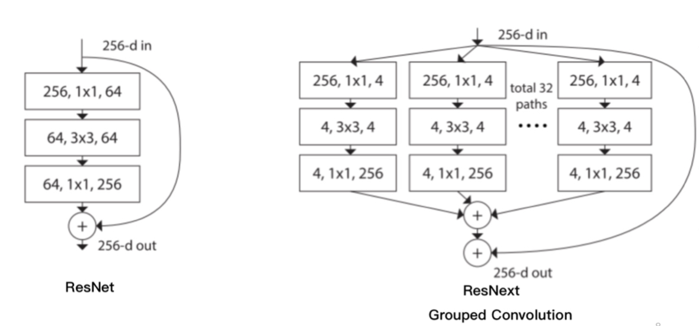
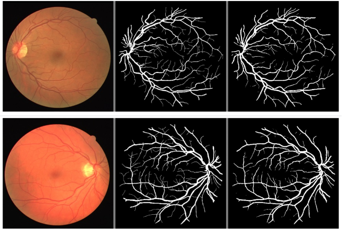
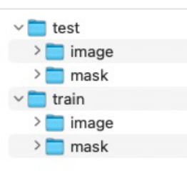

# 眼科智能诊断系统设计与评估

## 评价指标

### 灵敏度 (Sensitivity)
- **公式**: 灵敏度 (Sensitivity) = TPR = Recall（召回率） = TP / (TP + FN)
- **作用**: 反映漏报，即阳性但检查为阴性的情况。
- **特点**: 与模型性能有关，与测试样本先验分布无关。

### 特异度 (Specificity)
- **公式**: 特异度 (Specificity) = 1 - FPR，FPR = FP / (TN + FP)
- **作用**: 反映误报。
- **特点**: 与模型性能有关，与测试样本先验分布无关。

### 准确率 (Precision)
- **公式**: 准确率 (Precision) = TP / (TP + FP)
- **作用**: 反映误报。
- **特点**: 与模型性能有关，与测试样本先验分布有关。当数据内正负样本极不平衡时，AUC 缺乏指导意义，AP 更能反映模型性能，作为补充指标。

---

## 数据处理

### 数据脱敏
- 移除个人信息、敏感信息，给予隐私数据可靠保护。

### 数据采集
- **多样性**: 包括不同病种、不同医院、不同地区人群的数据。
- **标注数据获取**: 由多人标注。
- **数据量和测试集构建**: 确保数据量足够，构建合理的测试集。
- **数据预处理**: 去除质量低以及无法诊断的图像。
- **相机型号**: 考虑绑定不同模型，相机型号的影响。
- **采集人群比例**: 注意年龄、性别、地区的比例。

---

## 模型设计

### 多标签与多分类结合
- **模型选择**: SeresNext50，结合多标签与多分类。
- **结构**: ResNext = ResNet + Inception

- **分支结构**: 每个残差块中使用多个并行的分支，将特征按通道拼接输出。
- **SE模块**: 输出时添加注意力机制，给每个输出通道预测一个权重，并将权重与每个通道输出相乘。
- **目标检测**: 将眼底图像进行区域划分，在进入全连接层之前进行特征拼接。

---

## 模型评估

- **灵敏度 (Sensitivity)**
- **特异度 (Specificity)**
- **平均精度 (AP)**
- **曲线下面积 (AUC)**
- **准确率 (Precision)**

## 性能差异原因分析

- 不同测试集难度不同
- 不同模型性能不同

## 测试目的

- 识别模型在哪些病种上误报多，哪些病种上漏报多
- 评估模型对不同型号相机图像的适应情况，找出性能下降的型号
- 研究图像质量对模型性能的影响
- 界定测试集的难易程度，分析模型在不同难度测试集上的性能
- 探讨多病种同时发生时哪些病种容易混淆

---

# 基于深度学习的应用

## 视网膜血管分割
利用UNET网络进行视网膜血管分割，以单张视网膜眼底彩照作为输入，对其视网膜血管进行分割，如下图所示，第一列为输入图像，第二列为Ground truth，第三列为模型的预测结果。

数据集基本情况：
- 数据集官网：https://drive.grand-challenge.org/
- 图像尺寸为584x565x3，共40张，包括7个异常病例和33个健康病例的眼底彩照。图像的血管分割结果为眼科专家手动分割，其中训练集和测试集各20张，文件结构如下，image路径下为原图，mask路径下为手动分割结果。
  

---
## 基于眼底视网膜图像的身份认证

---
