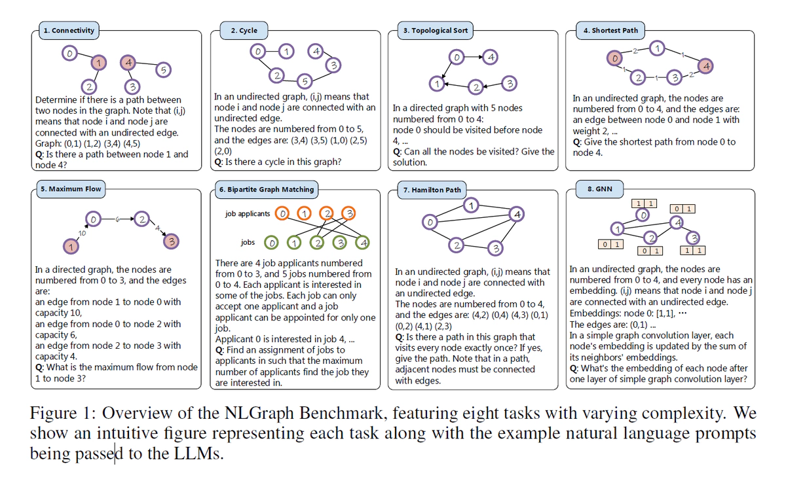
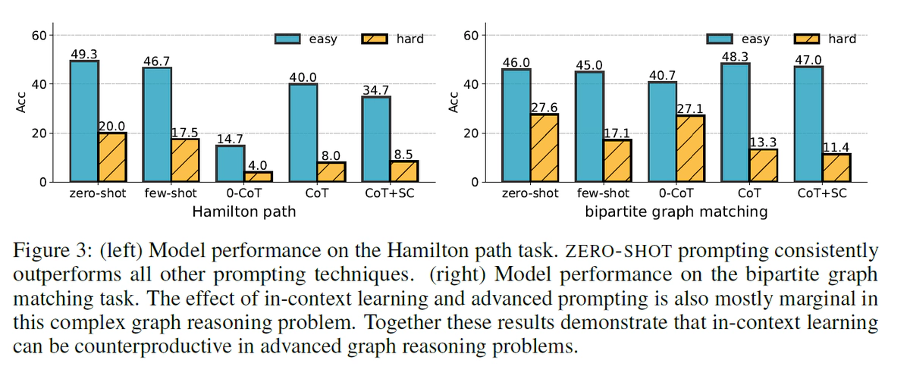
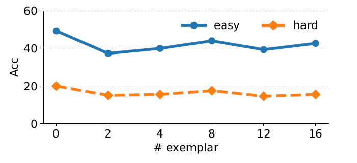
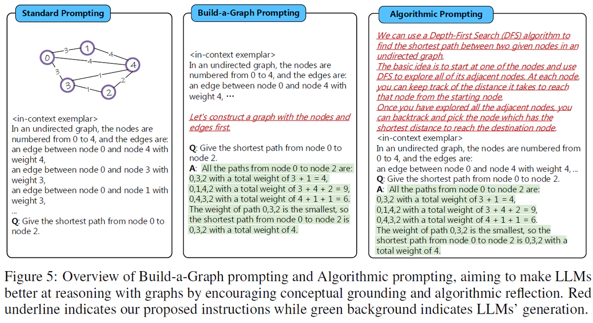

**title:** Can Language Models Solve Graph Problems in Natural Language?

**institute:** Department of Automation, BNRist, Tsinghua University 2Beijing Institute of Technology
3Carnegie Mellon University 4Beijing Academy of Artificial Intelligence

**authors:** C Ge, R Huang, M Xie, Z Lai, S Song, S Li, G Huang

**Date:** 2022.2.14

**link:** https://arxiv.org/abs/2202.06687

# 介绍
本文首次尝试使用大模型来解决图问题。在本文作者基于自然语言提出了含有千余个图基础问题的BenchMark NLGraph。作者在GPT3/4上进行实验获得了一些结论。在论文的最后，作者提出了两个可以提升大模型处理图问题的方法。

总结来讲，本文贡献如下：
- 提出了首个使用自然语言处理图问题的BenchMark NLGraph
- 在GPT3/4上进行实验并统计LLM performance，获得了一些规律
- 提出了两个改善方法

## NLGraph
这个BenchMark简单来讲就是一堆用自然语言描述的图并配有其对应的答案。

生成n个节点，每个节点间有边的概率设置为p。使用n和p来控制图的生成。对于个别的任务有更多的限制因子。

### 任务
NLGraph包含8种任务：
- 联通验证：询问两个点是否联通
- 图中是否存在环
- 拓扑排序
- 最短路
- 最大流
- 二分图匹配
- 哈密尔顿路
- 模拟图神经网络

### 统计
基础版本包含5902个样例，拓展版本包含29370个样例。

## 实验设置

### Baseline
作者使用了多种Prompt作为baseline：
- ZERO-SHOT
- FEW-SHOT
- CoT
- 0-CoT
- least-to-most (LTM-2023)：将一个大问题拆分成多个子问题逐个击破
- self-consistency (SC-2023)：同一个问题多种问法，最后取最一致的结果

同时作者也将随机作为一种Baseline，例如对于是否的问题，Baseline设置为50%，对于最短路问题将随机选取的路径是否正确作为baseline。

### Models
TEXT-DAVINCI-003、GPT3/4

## 结论

### 大模型对图问题有初步的推理能力
在联通验证、是否存在环、最短路问题上LLM performance显著高于Random，说明大模型不是随机给的答案，具有初步推理能力。
- 使用COT or COT+SC Prompt的准确率比Random准确率高了37.33%-57.82%
- 在联通验证、最短路问题上，使用ZERO-SHOT比Random准确率分别高了33.81%和23.33%
- 在最短路问题上，COT and COT+SC比Random高了22.81%-62.83%

### 高级Prompt不一定是有益的
高级Prompt如CoT，SC在大多数问题上提高了准确率。但是在复杂的图问题上，高级Prompt如COT, COT+SC, and LTM的效果反而低于Few-SHOT。作者认为这种现象的原因是大模型无法生成复杂图问题的思考链。

### 上下文Prompt可能适得其反

在复杂图形推理问题上，如哈密尔顿路径和二分图匹配问题上，ZERO-SHOT的效果好于Few-SHOT。这可能是在复杂问题上，LLM无法从上下文中获得知识，反而会降低注意力。

### LLMs是（不）出奇地脆弱
标题的意思是LLM有可能曲解了问题的推理过程。尽管LLM的效果很好，但是LLM可能通过利用某些虚假相关性来获得正确答案。举例来讲，由于更高度节点更常被提及且它们更有可能相连，语言模型可能只是计算节点出现次数而非实际查找路径。换言之，在连接性问题上，一些度特别多的点往往是相互连接的，这导致大模型可能人为度多的点就相互连接，而不是通过路径。

于是作者特地设计了两组数据：
- **Chain**：将一张图分为k个部分，每个部分是一条独立的链，查询每个链的首节点和尾节点是否相连。首尾虽然是度最小的，但是却相连。
- **Clique**：建立k个稠密的独立子图。从不同的子图中选取两个点，由于是稠密图，因此这两个点的度都很高。但是由于独立，这两个点却不相连。

不出意料的，LLM在这两个数据集上的performance下降了40%，证实了作者的猜想。

## 提高Performance的两个方法

### Build-a-Graph Prompting (BAG)
作者认为将图的文本描述映射到实际概念空间可能会有帮助。因此加了一句“让我们首先构建一个带有节点和边的图”。

### Algorithmic Prompting
提示LLM可以使用一些具体的算法解决问题。比如告诉他使用DFS或者BFS来解决这个问题。

### Result
在简单问题上，作者的两个方法可以提高3.07%-16.85%的Performance。但是对于复杂问题，没有提升。

## 总结

### 对比论文TALK LIKE A GRAPH：ENCODING GRAPHS FOR LARGE LANGUAGE MODELS
由于《TALK LIKE A GRAPH：ENCODING GRAPHS FOR LARGE LANGUAGE MODELS》在时间上更新，因此在下文简称为后者。而本文称为前者。

#### BenchMark
在BenchMark上两篇文章互补，问题种类上存在交集。

#### 在Prompt上
后者相比于前者增加了Encoding部分。在Prompt上两者各有区别，前者有LTM和SC两种Prompt，而后者有Bag prompting (COT-BAG)。不知道为什么后者遗弃了LTM、SC。

#### 在实验上
后者增加了模型容量对Performance 的影响，增加了图的形状的影响。在简单图任务上，两者的ZERO-SHOT都好于ZERO-COT。两人都发现复杂图任务使用高级Prompt会降低LLM Performance。两者都认为将“图的文本描述映射到实际概念空间可能会有帮助”，前者只是加了一句“Let’s construct a graph with the nodes and edges first”，但是后者却真的将LLM在现实问题上进行了实验。

#### 在创新上
前者的创新集中在数据集、实验设计、开创性上。后者的创新集中在将Encoding纳入变量上。

### Question

#### LLM在处理最短路问题上性能如何？其复杂度是否与环问题相同？
首先两个任务的性质是不同的，一个是找到正确路径，一个是True/False的问题。在本文，最短路和环的难度并不一样。环被划分为基础问题，有三个难度分级。而最短路被划分为进阶问题，有两个难度分级。

#### Generated
类似于后者，还有哪些变量可以被挖掘出来做实验？
- 语言？
- 点和边的数量上，小图、大图
- 邻接矩阵表示图
- 树相关的经典问题似乎没有提及到
  - 最小生成树
  - 树的直径
