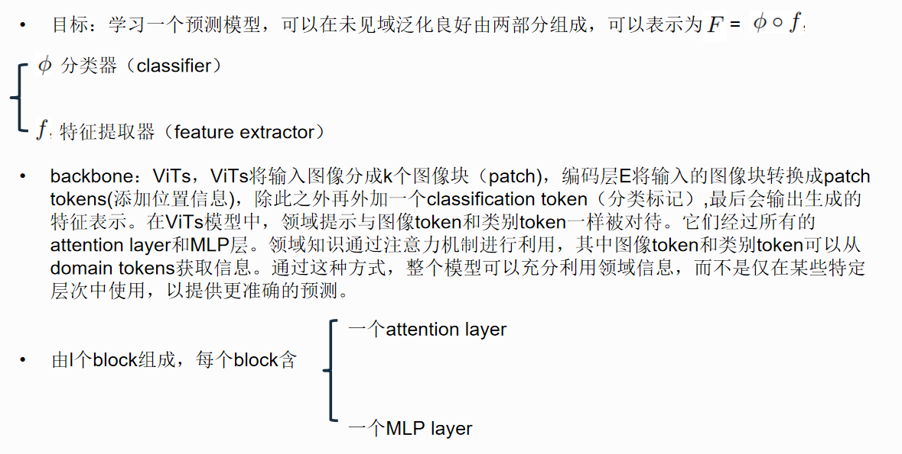
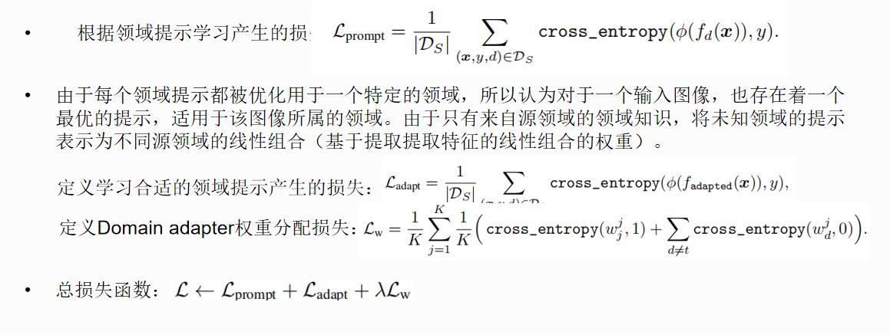
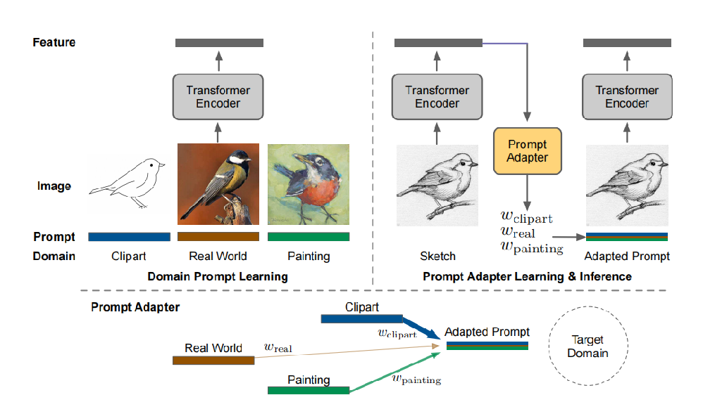

**title:** Prompt Vision Transformer for Domain Generalization

**institute:** National University of Singapore ,Berkeley

**authors:**  Zangwei Zheng, Xiangyu Yue Wang Kai Yang You

**Date:** 2022.8.18

**link:** https://arxiv.org/pdf/2208.08914

# 简介
这篇论文提出了DoPrompt，用于解决视觉转换器（ViTs）在面对未见领域时的泛化能力不足的问题。之前的领域泛化算法无法很好地与ViTs结合，于是提出了基于提示学习（Prompt Learning）的方法，将源域的知识嵌入到目标域的预测中。具体而言，作者在ViT输入tokens之前添加了域提示，每个域提示仅针对一个域进行优化，从而高效地学习域特定知识。与此同时，训练一个提示适配器，根据学习到的源域提示为每个输入图像生成合适的提示。在测试时，提示适配器生成的适应性提示可以利用目标图像与源域特征之间的相似性，正确地整合源域知识。作者在四个基准数据集上进行了大量实验，在平均准确率上实现了1.4%的提升，这比具有ViT backbone的最先进算法的改进提高了3.5倍。

这篇论文的主要贡献包括：
1. 对ViTs进行了领域泛化算法的基准测试，表明尽管ViTs在某些情况下优于ResNet-50，但许多先前的方法很难改善ViTs在领域泛化方面的性能。
2. 提出了一种有效的领域泛化算法DoPrompt，其中包括域提示学习（DPL）和提示适配器学习（PAL）两个部分。
3. 是首个考虑到ViTs的领域泛化算法，其在多个基准数据集上均以较大的优势超越了现有最先进方法。

# Method overview

实验基于 DomainBed 实现。框架为 PyTorch。模型使用在 ImageNet 上预训练的 ViT-Base/16 模型。优化器采用 AdamW。模型选择采用训练域验证集方法。验证过程中对于 DoPrompt，采用与测试相同的推理过程，而不使用 domain token。

DoPrompt 由 DPL 和 PAL 组成：

- 领域提示学习（Domain Prompt Learning, DPL）：每个源领域的图像块标记引入了相应的提示标记，使模型能够捕捉领域特定的知识。
- 提示适配器学习（Prompt Adapter Learning, PAL）：学习涉及使用提示适配器集成学到的源领域提示，促进了对领域特定知识在预测中的有效利用。提示适配器被训练以区分来自不同领域的特征并生成有助于正确预测的提示（即 adapted prompt）。

同时，作者发现不同的 backbone 会对预测结果带来不同的影响，且之前的方法都是基于对齐的，无法扩展至领域泛化。所以本文重新选择了 backbone：ViTs。

原因：
1. 可以动态地关注不同位置的信息。
2. 对纹理的 bias 较小，而纹理通常被认为会影响某些领域泛化。
3. 使用全局的 self-attention 机制。

# 总结

总结一下，整个 DoPrompt 方法如下：

输入：
- T：训练步数。
- f：特征提取器。
- φ：分类器。
- prompts：领域提示。
- A：领域适配器。

训练过程：
1. 在每个训练步骤 s 中，从 m 个领域（D1, ..., Dm）中采样一批样本。
2. 进行领域提示学习，根据公式计算提示损失 Lprompt。
3. 进行领域适配器学习，对于每个领域 i：
   - 计算样本的梯度 hi，其中 hi 是特征提取器输出的梯度，通过 stop_gradients 阻止梯度回传。
   - 使用领域适配器 A 对特征 hi 进行适应，生成 adapted_prompts。
   - 根据公式计算损失 Lw 和 Ladapt。
4. 计算最终损失 L，其中包括 Lprompt、Ladapt 和 λ(Lw)。
5. 反向传播损失 L 并更新模型参数。

输出：经过 T 步训练后，模型参数得到更新。
