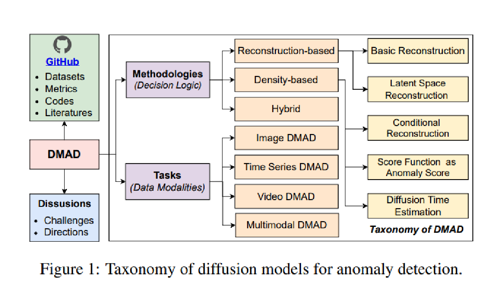
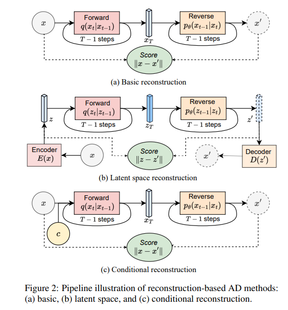
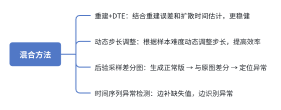

**title:** A Survey on Diffusion Models for Anomaly Detection

**institute:** University of British Columbia, Vancouver, Canada, Fudan University, Shanghai, China, Duke Kunshan University, Suzhou, China

**authors:**  Jing Liu1,2, Zhenchao Ma1, Zepu Wang3, Chenxuanyin Zou1, Jiayang Ren1, Zehua Wang1, Liang Song2, Bo Hu2 , Yang Liu2,3 , Victor, C.M. Leung1

**Date:** 2025.02

**link:** https://arxiv.org/pdf/2501.11430

# 介绍
本文是关于 **Diffusion Models (DM) 在异常检测（Anomaly Detection, AD）** 方向的系统综述。主要目标是梳理 DM 在不同异常检测场景下的应用与挑战。

---

## Background
- **Diffusion Models定义**：通过逐步加噪和去噪过程来建模数据分布的概率生成模型。Denoising其实对应的是反向过程中的一个逐渐去噪的过程，diffusion指一个前向的逐步加噪过程：从真实数据出发，不断加入小高斯噪声，概率模型指的是他其中涉及的一些原理和推导。
  - 前向过程（Diffusion）：给定一张原始的图，通过t次加噪，每次向图片之中加入一些噪点，这样经过t次过后，我们可以得到一个非常杂乱无章的噪声。
  - 反向过程（Denoising）：学习如何从噪声逐步恢复原始数据。  

- **异常检测中的思路**：  
  - 如果模型能较好地重建正常样本 → 样本属于正常分布。  
  - 如果重建困难或概率低 → 样本可能是异常。  

---

## 传统方法 vs 扩散模型

| 传统方法 | 论文指出的不足 | 扩散模型（DM）的优势 |
|----------|----------------|----------------------|
| 传统机器学习 / 深度学习特征提取 （One-class SVM, Isolation Forest, CNN/RNN等） | 对复杂高维数据泛化不足；特征往往依赖手工设计或特定领域，不够灵活【论文 1 引言】 | DM 直接学习正常分布，不依赖手工特征；生成式建模更适应复杂模态（图像、时序、视频）【论文 1】 |
| 基于生成模型的正常性学习（VAE、GAN） | GAN/VAE 模式覆盖有限，可能把异常样本也“重建得很正常”；GAN 训练不稳定【论文 1 、2.2】 | DM 重建质量更高，模式覆盖更广；训练过程比 GAN 稳定，不易模式崩塌【论文 2.2–2.3】 |
| 端到端异常评分学习（直接学习 score function） | 依赖人工标签/阈值，在分布漂移场景下泛化差；缺乏可解释性【论文 1】 | DM 与分数匹配/密度估计天然相关，可直接提供异常分数（score 或扩散时间）；还能输出重建差分图/分数场，增强解释性【论文 2.3, Fig.3】 |

相比传统方法，扩散模型有三个特别实用的好处：
第一，它不用我们自己去挑什么特征，而是整体判断“像不像以前学过的正常”。
第二，它的还原图片里的细节能力很强，能覆盖各种正常情况，训练过程也更稳定，不容易像 GAN 那样崩掉。
第三，可解释性较强：它跟分数匹配、密度估计有联系，可以算出“这个点有多不合群

---
## Taxonomy
论文把扩散模型用于异常检测分为了两条线
第一条线是 Methodologies，也就是方法学分类。
重建式是看“能不能重建好”；密度式是看“它在正常分布里多不常见”；混合式是把两者结合
第二条线是 Tasks，也就是应用的任务/数据模态分类。主要包括四种：图像异常检测、时间序列异常检测、视频异常检测和多模态异常检测。

---
## Methodologies

本文将基于扩散模型的异常检测方法分为三大类：  
- **重建式**：看模型能否成功还原输入  
- **密度式**：看样本在正常分布中是否罕见  
- **混合式**：结合重建和密度，两者互补  

1. **Reconstruction-based Methods**  

**(a) Basic reconstruction（基础重建）** 
- 思路：  
  将图像逐步加噪 → 变成纯噪声 → 用扩散模型去噪还原 → 对比原图与重建图差异。  
- 如果差异很大 → 可能是异常。    

**(b) Latent space reconstruction（潜空间重建）**  
- 思路：  
  用编码器将高维图像压缩到潜空间 → 在低维表示里加噪/去噪 → 再解码还原。  
- 优点：速度更快、计算量小，适合大分辨率图像和视频。  

**(c) Conditional reconstruction（条件重建）**  
- 思路：  
  在去噪时引入条件输入（如掩码、类别、文本提示）。  
- 好处：避免模型把异常也修得很正常；  
  条件引导下，模型专注还原正常部分，保留异常 → 便于检测。  

2. **Density-based Methods**  

**(a) 分数函数打分**  
- 将样本加噪后送入扩散模型前向过程；  
- 用分数网络估计其“分布梯度” → 判断它是否处于正常分布范围；  
- 如果分数大 → 离正常分布远 → 判为异常。  

**(b) Diffusion time estimation (DTE, 扩散时间打分)**  
- 思路：预测样本需要多少步扩散才能回到正常分布。  
- 正常样本 → 很快对齐；  
- 异常样本 → 需要更多步才能靠拢。  

3. **Hybrid-based Methods** 
结合重建误差与密度估计，互相补充。  
- 重建式缺点：有时会把异常“修太好” → 漏检。  
- 密度式缺点：在高维复杂数据中不稳定。  
→ 混合方法能更稳健。  

**(a) DTE + 重建结合**  
- DTE 衡量全局分布距离；  
- 重建误差衡量局部修复能力；  
- 结合后在医学影像等场景更稳健：  
  - DTE 做全局筛查  
  - 重建误差做局部定位。  

**(b) 动态噪声 / 步长调整**  
- 原始扩散模型步数固定，效率低。  
- 动态方法：  
  - 正常样本 → 少走几步，快速通过；  
  - 可疑样本 → 多走几步，重建更仔细。  
- 既省时又保证准确性。  

**(c) 差分图 (Posterior Sampling) 定位异常**  
- 扩散模型生成“正常版”重建图 → 与输入图做差 → 异常区域凸显。  
- 应用：医学影像中，差分图可直观显示病灶，增强可解释性。  

**(d) 插补 + 检测（时间序列场景）**  
- 时间序列中常有缺失值。  
- 扩散模型一边补数据，一边判断：  
  - 能顺利补上 → 正常缺失；  
  - 补不上或不协调 → 异常。  
- 一举两得：既补全数据，又检测异常。  

---
## Tasks

作者根据不同数据模态，总结了 **Diffusion Models for Anomaly Detection (DMAD)** 的四个研究方向，并列出代表性方法、开源实现、数据集和实验结果。

### 1. 图像异常检测 (IAD)
- **目标**：识别整幅图像或局部区域的异常。  
- **方法**：  
  - 重建误差作为异常分数。  
  - 全局+局部适应（GLAD）、相似性度量（ODD）、掩码扩散（mDDPM, FNDM）。  
  - 对抗样本生成等提升效果。  
- **应用场景**：医学影像、工业缺陷检测。  

### 2. 时间序列异常检测 (TSAD)
- **目标**：检测点异常、上下文异常、群体异常。  
- **方法**：  
  - 潜在空间建模（NGLS-Diff）。  
  - 结构化状态空间层（Zuo 等）。  
  - 动态分解（D3R）。  
  - 大模型框架（TimeDiT）。  
  - 缺失值填补与自监督学习。  

### 3. 视频异常检测 (VAD)
- **目标**：利用时空信息检测异常事件。  
- **方法**：  
  - 基于重建误差。  
  - VADiffusion（双分支结构）、FDAE（流引导自编码器）。  
  - 特征预测、混合框架、掩码扩散。  
- **应用场景**：运动异常、外观异常检测。  

### 4. 多模态异常检测 (MAD)
- **目标**：融合图像、文本、语音、骨架等多源数据。  
- **方法**：  
  - AnomalyXFusion：图像 + 文本 + mask 融合。  
  - 运动条件扩散模型：用于骨架视频。  
  - 文本辅助提升图像异常检测。  
  - GLAD 扩展至多模态。  
  - LLM 引入上下文解释。  

---

## 关键挑战与研究方向

| Challenges | Problems | 潜在方向 |
|------------|----------|----------|
| 计算效率 | 训练与采样开销大，特别是高维和长序列数据 | 蒸馏、步长优化、模型压缩（剪枝/量化）、高效SDE |
| 可解释性 | 去噪过程复杂，难以解释模型为何判定异常 | 热力图/差分可视化，结合 xAI 方法，借助 LLM 生成解释 |
| 复杂分布 | 类别不平衡、多峰正常分布、缺失/噪声干扰 | 数据增强、鲁棒训练、缺失值建模、动态步长 |
| 鲁棒性 | 对抗样本可能被“净化”，潜空间扩散更脆弱 | 针对性防御策略（如 DIFFender）、区分异常信号与噪声 |
| 边云协同 | 模型庞大，难在边缘端实时运行 | 轻量化边端初筛 + 云端重构，联邦学习保障隐私 |
| LLM 融合 | 时序/数值数据难以 token 化，LLM 不适配 | 开发专门的表示/Tokenizer，结合 LLM 做解释与上下文建模 |

---

