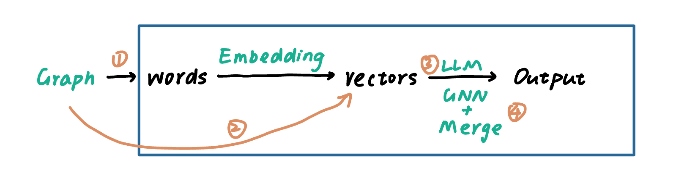
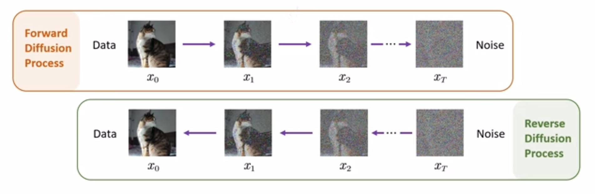
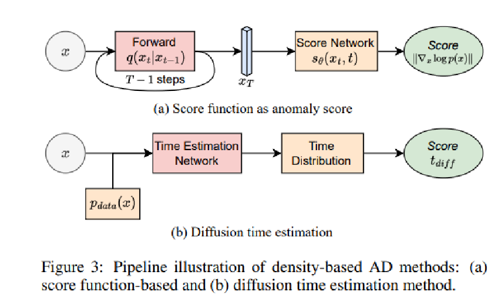

**title:** A Survey on Diffusion Models for Anomaly Detection

<!-- **institute:** Google Research

**authors:**  Bahare Fatemi, Jonathan Halcrow, Bryan Perozzi

**Date:** 2023.10.06

**link:** https://arxiv.org/pdf/2310.04560
# 介绍
本文尝试使用不同自然语言的方式将图输入大模型测试并测试性能。

## 前言

目前学界有四种方法使用LLM处理图问题：
- 使用自然语言输入
- Embedding
- LLM tuning
- Hybrid : GNN & LLM

其中，本文主要探讨使用第一种方法处理图的问题。作者提到使用我们在本文中发现的规律来编码图可以使大模型的性能从4.8%提升至61.8%。

## 本文贡献
作者尝试找到一种最适合的方式使LLM处理graph reasoning问题，作者将此问题分成了下面的两个方面：
- encoding
- prompt

提出了一组新的benchmarks GraphQA。

## Encoding
Encoding graph as text 可以被分为两个部分，分别是对节点的编码和对边的编码。

### Encoding Nodes
- 整型表示
- 英文姓
- 影视剧角色
- 政客姓
- 字母表示

### Encoding Edges
- 圆括号表示
- 好友关系
- 共同作者关系
- 社交关系
- 箭头
- 连接（例：Node 0 is connected to nodes 1, 2）

### 本文对图的编码就是对上述两种方式的排列组合
- **Adjacency**：整型+圆括号表示
- **Incident**：整型+连接
- **Friendship**：英文姓+好友关系
- **Co-authorship**：英文姓+共同作者关系
- **SP**：影视剧角色+好友关系
- **GOT**：影视剧角色+好友关系
- **Social network**：英文姓+社交关系
- **Politician**：政客姓+社交关系
- **Expert**：字母表示+箭头

## Prompt
- **Zero-shot prompting (ZERO-SHOT)**：描述问题，直接提问
- **Few-shot in-context learning (FEW-SHOT)**：举例
- **Chain-of-thought (CoT)**：提供例子，以及解决问题的步骤
- **Zero-shot CoT prompting (ZERO-COT)**：给予解决问题的步骤，但是不给例子。“Let’s think step by step”
- **Bag prompting (COT-BAG)**

## GraphQA
GraphQA包含多种图领域的基本问题：
- 边存在
- 节点存在
- 节点计数
- 边计数
- 是否是连通图
- 环检查
- 是否是孤立点图

## Experiments

### 1. Encoding & Prompt
实现对象：PaLM 62B
- 大模型在图基础问题上表现很差
- 对于简单的图的任务，ZERO-SHOT好于ZERO-COT，对于复杂任务则相反
- 不同的Encoding方法对性能影响很大
- 使用整型Encoding Nodes会提高性能

### 2. Varying Prompt Questions
在绝大部分的实验中，将图问题编码成现实问题可以提高模型性能。

### 3. 多种关系编码
使用多种关系对图编码不仅没有损害LLM的性能，反而提高了。这种改进可能是因为多样化关系与LLM的训练集更接近。

### 4. 模型容量
模型容量显著影响性能。

### 5. 孤立图推理
接近于0，LLM对于孤立图几乎没有推理能力。

### 6. 图的形状是否有影响

- 图的结构显著影响LLM性能
- 图中多余的结构会影响LLM性能：LLM在Path和Star结构的图上的性能最好
- 提供实例和推理链可以提高LLM性能

## 结论
- LLM在基础图问题上表现很差
- Graph Encoding方式显著影响LLM性能
- 模型参数量对精度影响显著

## Thinking

### 模型上
- 在6B、7B模型上的表现如何？
- 适应小模型的Encoding方式
- Emergence Feature为什么没有在图问题上出现？

### 实验所用到的图主要是小图
- LLM的性能与图的大小是呈怎样的关系？
- 能否设计出一种针对大图的输入方式？
- 为什么LLM在处理现实的图问题上表现要更好？这种现象是否存在于其他问题？

### 其他
- 为什么没有与Embedding的方式进行对比？
- LLM在处理最短路问题上性能如何？其复杂度是否与环问题相同？ -->
